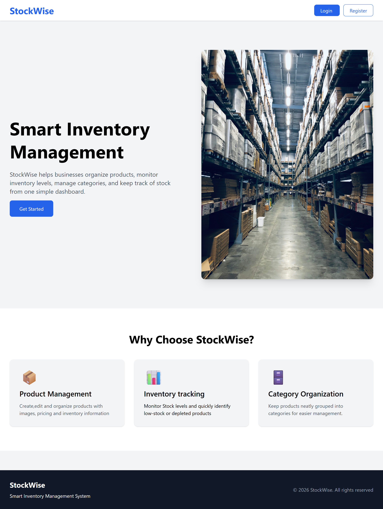
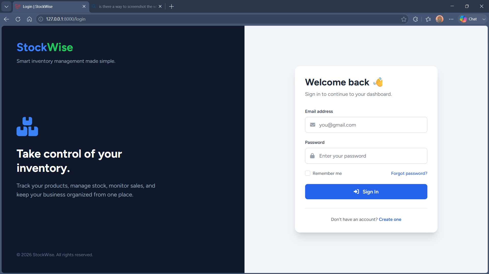
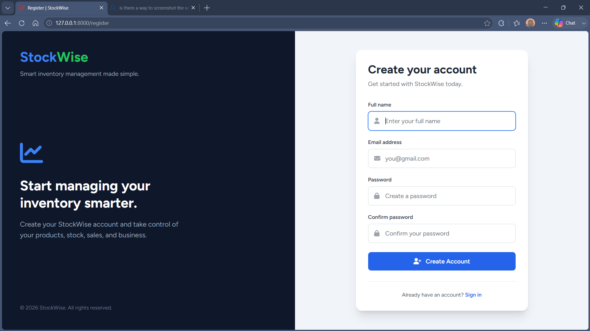
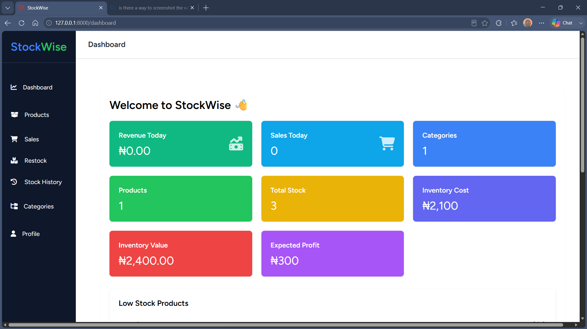
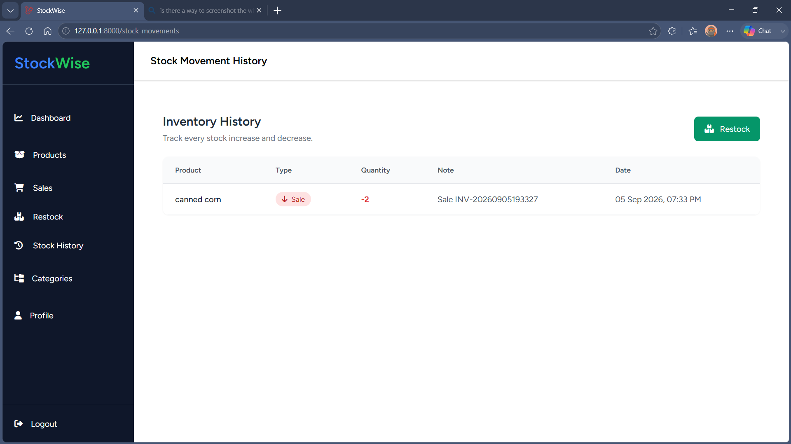

# StockWise

**StockWise** is a web-based inventory management system designed to help small businesses manage their products, stock levels, sales, restocking activities, and inventory history from one centralized platform.

The system provides a clean dashboard for monitoring inventory activity and automatically generates key business metrics from the application's underlying data.

## Screenshots

### Welcome Page

### Login

### Register

### Dashboard

### Stock History

## Key Features

* User registration and authentication
* Product management
* Category management
* Sales recording
* Stock restocking
* Stock movement tracking
* Inventory history
* Automated dashboard statistics
* Low-stock monitoring
* Responsive interface
* Organized navigation for inventory operations

## Automated Dashboard

The StockWise dashboard is **data-driven and automated**, rather than using static or hard-coded figures.

Dashboard statistics are calculated from the application's actual inventory records and update as users perform operations such as:

* Adding products
* Recording sales
* Restocking inventory
* Updating stock quantities
* Creating stock movements

This allows the dashboard to provide an up-to-date overview of the current state of the inventory.

## Stock History

StockWise maintains a record of inventory movements, making it possible to track changes to stock over time.

The stock history helps users understand when inventory was added, removed, or otherwise changed.

## Technology Stack

* **Backend:** Laravel / PHP
* **Frontend:** Blade, HTML, CSS, JavaScript
* **Database:** MySQL
* **UI:** Tailwind CSS
* **Charts:** Chart.js
* **Development Environment:** XAMPP / VS Code

## What This Project Demonstrates

StockWise demonstrates practical experience with:

* MVC architecture
* Database design and relationships
* CRUD operations
* Authentication and authorization
* Form validation
* Dynamic data processing
* Inventory and transaction management
* Database-driven dashboards
* Responsive UI development
* Laravel application development

## Project Purpose

StockWise was built to explore how software can solve everyday inventory management problems for small businesses that may still rely on manual stock records.

The goal is to provide a simple digital alternative for tracking products, sales, stock levels, and inventory activity.

## Future Improvements

Potential future improvements include:

* Barcode scanning
* Multiple business accounts
* Staff roles and permissions
* Sales reports
* Exportable inventory reports
* Automated notifications for low-stock products
* Cloud-based deployment and subscription management

## Project Status

StockWise is a functional inventory management system developed independently as part of my software engineering portfolio.

## Usage & Attribution

This repository is presented as a portfolio project. Please do not copy or present the project or its work as your own.

For reuse or redistribution, please contact the project author.

## Author

**Fortune Charles**

Software Engineering Student & Backend Developer
